# Phase 2 — Deploy the Infrastructure Using Terraform

## Overview

In this phase, we will deploy the complete AWS infrastructure using the Terraform configuration files created in Phase 1.

Terraform automatically reads every `.tf` file present in the project directory and combines them into a single execution plan. Unlike traditional programming languages, Terraform does not execute files sequentially. Instead, it analyzes the resource dependencies and provisions the infrastructure in the correct order.

During this phase, Terraform will provision the complete networking infrastructure along with an EC2 instance running the Nginx web server.

---

# Resources That Will Be Created

The following AWS resources will be created during the deployment.

| AWS Resource | Purpose |
|--------------|---------|
| VPC | Creates an isolated virtual network |
| Public Subnet | Hosts internet-facing resources |
| Private Subnet | Hosts internal resources |
| Internet Gateway | Provides internet connectivity |
| Public Route Table | Routes internet traffic to the Internet Gateway |
| Private Route Table | Routes private network traffic |
| Route Table Associations | Associates subnets with route tables |
| Security Group | Controls inbound and outbound traffic |
| EC2 Instance | Hosts the Nginx web server |

---

# Deployment Workflow

Terraform performs the deployment using the following workflow.

```text
                Terraform Configuration Files
                           │
                           ▼
                  Load Input Variables
                           │
                           ▼
                 Initialize AWS Provider
                           │
                           ▼
                 Validate Configuration
                           │
                           ▼
                Build Dependency Graph
                           │
                           ▼
                  Generate Execution Plan
                           │
                           ▼
                  Create AWS Resources
                           │
                           ▼
               Store Infrastructure State
                           │
                           ▼
                  Display Output Values
```

---

# Step 1 — Verify the Project Structure

Open the project folder using **Visual Studio Code**.

Verify that the project contains the following files.

```text
terraform-nginx-lab/

│
├── versions.tf
├── provider.tf
├── variables.tf
├── terraform.tfvars
├── main.tf
├── subnet.tf
├── igw.tf
├── route-table.tf
├── security-group.tf
├── ec2.tf
├── outputs.tf
├── userdata.sh
├── .gitignore
└── README.md
```
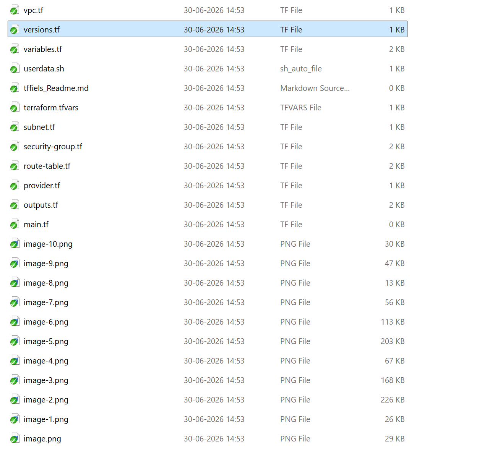
---

# Step 2 — Format the Terraform Configuration

Run the following command.

```bash
terraform fmt
```

### Purpose

Formats every Terraform configuration file according to the official HashiCorp formatting standards.

### Expected Output

```text
All Terraform files are formatted successfully.
```

> **Note**
>
> If no files require formatting, Terraform completes without displaying any changes.

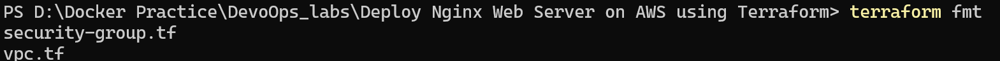
It means:

Terraform reformatted these files and saved them.

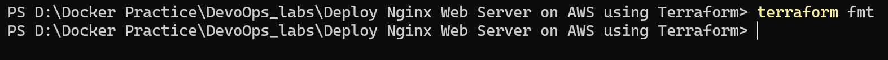
---
# Step 3 — Initialize Terraform

Run the following command.

```bash
terraform init
```

### Purpose

Initializes the Terraform working directory.

During initialization Terraform performs the following tasks.

- Downloads the AWS Provider
- Creates the `.terraform` directory
- Creates the provider lock file
- Prepares the working directory

### Expected Output

```text
Terraform has been successfully initialized!
```
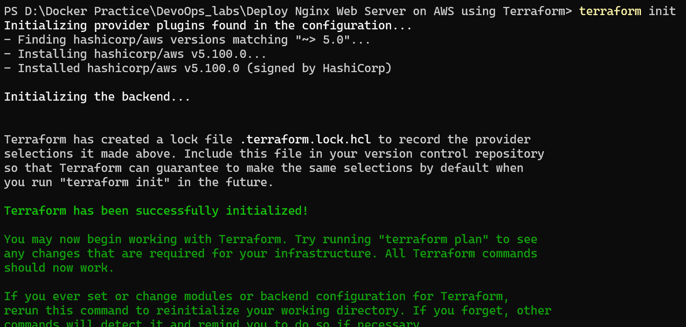
---

# Step 4 — Validate the Terraform Configuration

Run the following command.

```bash
terraform validate
```
### Purpose

Validates the syntax and structure of every Terraform configuration file before deployment.

Terraform checks for:

- Invalid syntax
- Missing arguments
- Invalid references
- Resource configuration errors

### Expected Output

```text
Success! The configuration is valid.
```
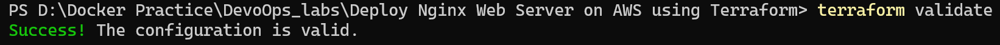
---


# Step 5 — Review the Execution Plan

Run the following command.

```bash
terraform plan
```
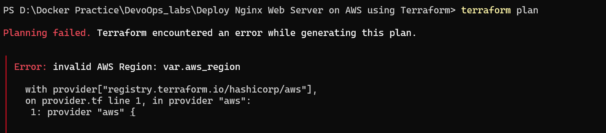
Reason : This is wrong because "var.aws_region" is treated as a string. no quotes around var.aws_region.

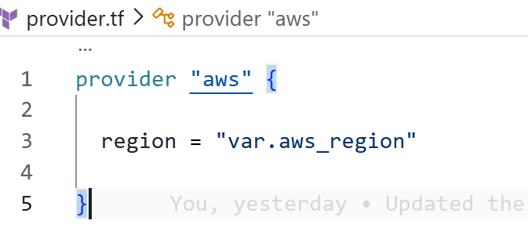

### Purpose

Compares the desired infrastructure with the current AWS environment and generates an execution plan.

No resources are created during this step.

Terraform only displays what will happen after running `terraform apply`.

The execution plan should contain resources similar to the following.

```text
aws_vpc

aws_subnet.public

aws_subnet.private
```

Review the execution plan carefully before continuing.
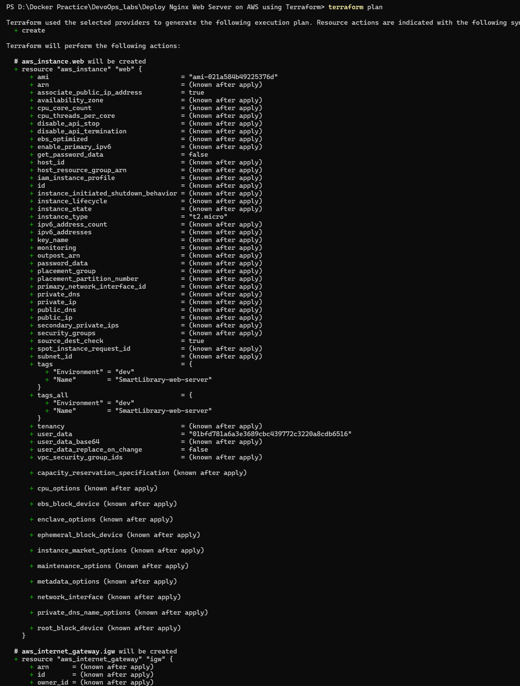
---

# Step 6 — Deploy the Infrastructure

Run the following command.

```bash
terraform apply
```

Terraform displays the execution plan again.

Type the following when prompted.

```text
yes
```
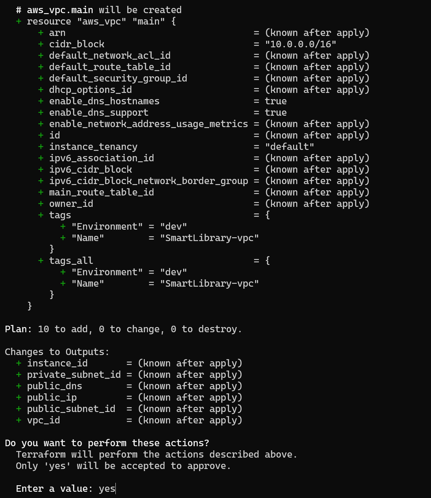

Terraform now begins provisioning the AWS infrastructure.

---

# Infrastructure Creation Order

Terraform automatically determines the correct order in which resources should be created.

```text
VPC
 │
 ▼
Subnets
 │
 ▼
Internet Gateway
 │
 ▼
Route Tables
 │
 ▼
Route Table Associations
 │
 ▼
Security Group
 │
 ▼
EC2 Instance
```

This dependency graph is generated automatically by Terraform.

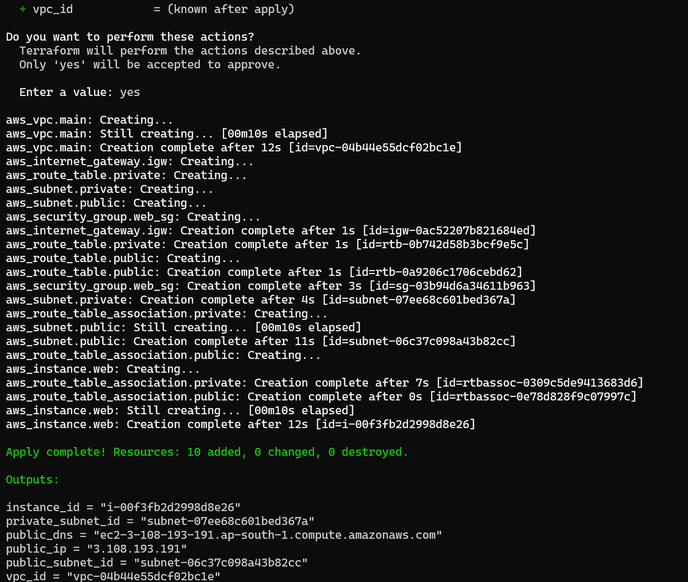
---

# Step 7 — Verify Successful Deployment

After the deployment completes successfully, Terraform displays output similar to the following.
```terraform state list```

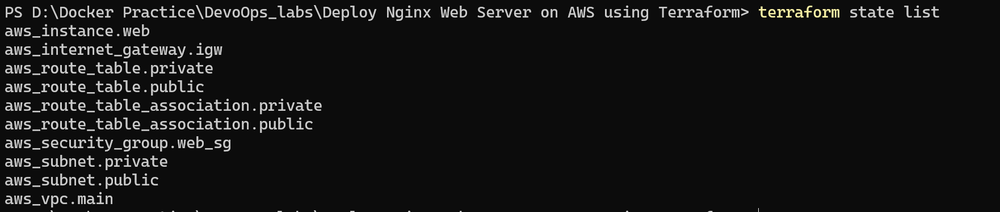

```text
Apply complete!

Resources:
9 added
0 changed
0 destroyed
```

The exact number of resources may vary depending on your configuration.

---

# Step 8 — Display Terraform Outputs

Run the following command.

```bash
terraform output
```
Terraform displays useful information such as.

- VPC ID
- Public Subnet ID
- Private Subnet ID
- EC2 Instance ID
- Public IP Address
- Private IP Address

These values will be used in the verification phase.
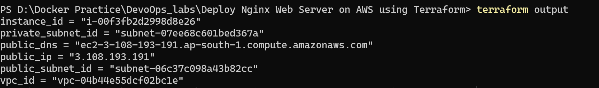
---

# Files Generated After Deployment

After a successful deployment, Terraform creates several additional files.

```text
terraform-nginx-lab/

├── .terraform/
├── .terraform.lock.hcl
├── terraform.tfstate
├── terraform.tfstate.backup
```
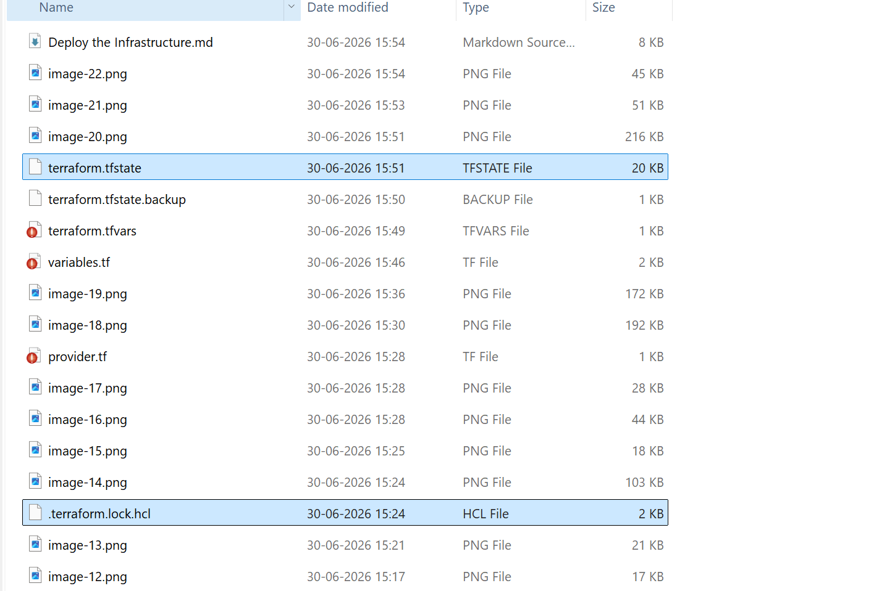
These files store the infrastructure state and provider information.

> **Important**
>
> Do not manually edit the `terraform.tfstate` file.

---
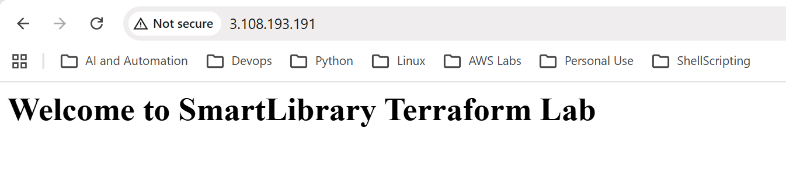

# Expected Outcome

After completing this phase, the following infrastructure will be successfully deployed.

- Custom VPC
- Public Subnet
- Private Subnet
- Internet Gateway
- Public Route Table
- Private Route Table
- Route Table Associations
- Security Group
- Amazon Linux EC2 Instance
- Nginx Web Server

The infrastructure is now ready for validation in the next phase.