# LAB 01: Deploy an Nginx Web Server on AWS Using Terraform

## Objective

The objective of this lab is to provision a complete AWS networking environment and deploy an Nginx web server on an EC2 instance using Terraform. Unlike manually creating resources through the AWS Management Console, this lab demonstrates how Infrastructure as Code (IaC) can be used to automate the provisioning of AWS infrastructure.

By the end of this lab, you will have a fully functional Nginx web server running inside an AWS VPC and accessible through a web browser.

---

## Learning Objectives

After completing this lab, you will be able to:

- Understand the complete Terraform workflow,Understand Infrastructure as Code (IaC), Configure Terraform to communicate with AWS
- Build AWS infrastructure using Terraform,Create a custom VPC,Create Public and Private Subnets,Create and Attach an Internet Gateway
- Configure Route Tables,Create Security Groups,Launch an EC2 Instance,Automatically install Nginx using User Data
- Validate the deployed infrastructure,Destroy infrastructure safely using Terraform

---

# Real-Time Scenario

Assume you have joined **Symbolona Technologies** as a Junior DevOps Engineer.Your manager assigns you the following task.

> Deploy a web server for the SmartLibrary application.

The infrastructure team has provided the following requirements.

• One custom VPC

• One Public Subnet

• One Private Subnet

• One Internet Gateway

• Public Route Table

• Private Route Table

• Security Group

• One Amazon Linux EC2 Instance

• Automatically install Nginx

• Verify the application using the browser

The entire infrastructure must be created using Terraform.

No manual resource creation is allowed except AWS authentication.

---

# Final Architecture

```text
                           Internet
                               │
                               │
                     Internet Gateway
                               │
                    Public Route Table
                               │
                        Public Subnet
                               │
                     Security Group
                               │
                     EC2 (Amazon Linux)
                               │
                          Nginx Server
                               │
                    Public IP Address
                               │
                          Web Browser


                Private Route Table
                        │
                Private Subnet

```

---

# Infrastructure Components

This lab provisions the following AWS resources.

| Resource | Quantity |
|----------|----------|
| VPC | 1 |
| Public Subnet | 1 |
| Private Subnet | 1 |
| Internet Gateway | 1 |
| Public Route Table | 1 |
| Private Route Table | 1 |
| Route Table Associations | 2 |
| Security Group | 1 |
| EC2 Instance | 1 |

---

# How Terraform Communicates with AWS

Terraform never logs into AWS using your email address or password.

Instead, Terraform authenticates using AWS credentials that are stored locally by AWS CLI.

The authentication flow is shown below.

```text
              Your Laptop

                    │

              Terraform CLI

                    │

             AWS Provider Plugin

                    │

      AWS Access Key + Secret Key

                    │

               AWS REST APIs

                    │

               AWS Infrastructure
```

---

# Prerequisites

Before starting this lab, ensure the following software is installed.

## Required Software

| Software | Status |
|----------|--------|
| VS Code | Installed |
| Git | Installed |
| Terraform | Installed |
| AWS CLI | Installed |

---

## AWS Account

You must have:

- AWS Account
- IAM User
- Access Key
- Secret Access Key

> Never use the AWS Root User for Terraform.

---

# Verify Terraform Installation

Open Command Prompt.

Run:

```cmd
terraform version
```

Expected Output

```text
Terraform v1.x.x

```
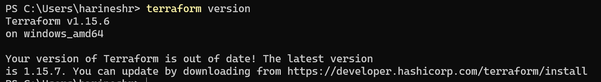
---

# Verify AWS CLI Installation

Run:

```cmd
aws --version
```

Expected Output

```text
aws-cli/2.xx.x
```
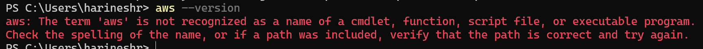

# How to setup AWS CLI on Your Laptop 

### Step1 - Create an AWS Account if you don't have 
### Step2 - Create an IAM User for Terraform
Open AWS Console-->IAM-->Users-->Create User
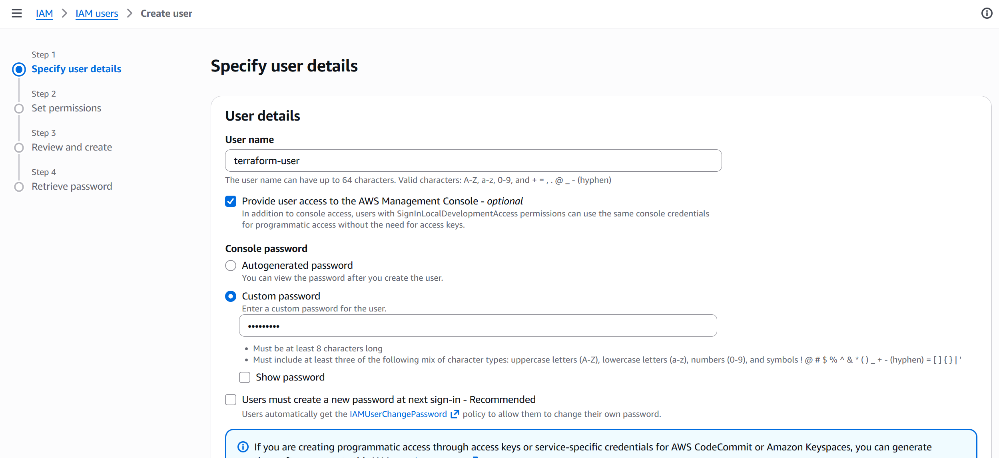
Example
terraform-user
Enable :  Provide user access to AWS Management Console (Optional)
Click Next -- > Attach Permissions
For learning purposes :  AdministratorAccess
Production environments should use least-privilege IAM policies instead of AdministratorAccess.
Click
Next
Create User
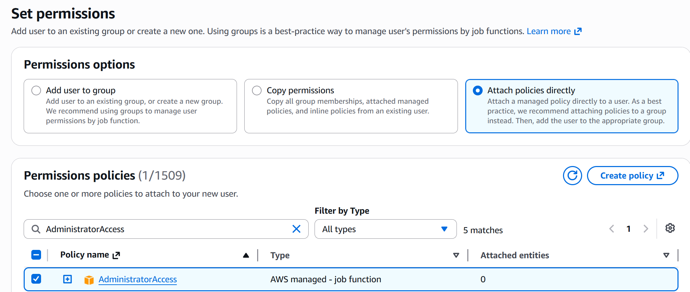
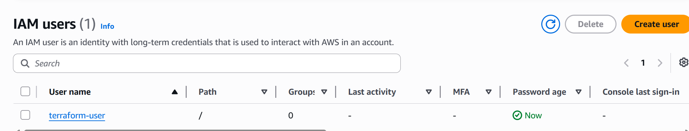

### Step3- Create Access Keys
```python
After the user is created 
↓
Open terraform-user-->Security Credentials-->Access Keys
↓
Create Access Key--> Choose
Command Line Interface (CLI)
Tick the confirmation checkbox.
Click
Next
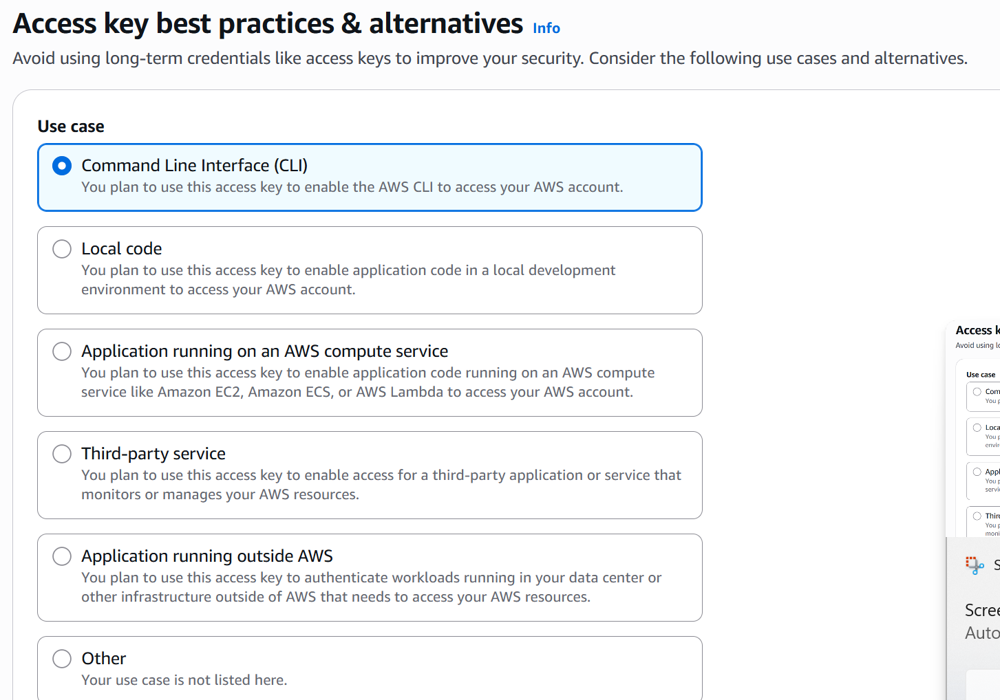
↓
Provide a description: Terraform Laptop
Click
Create Access Key
↓
You will receive
Access Key ID
Secret Access Key
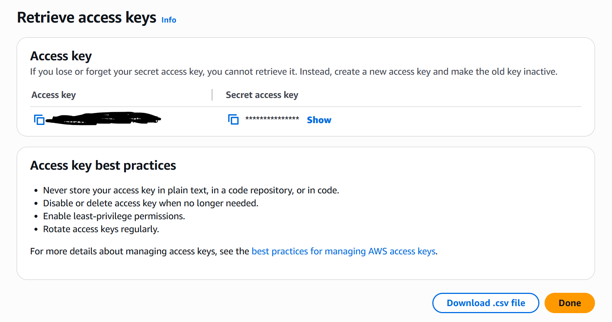
```
### Step4- Download and Isntall AWS CLI

```python
Download AWS CLI for Windows:

https://aws.amazon.com/cli/

Download

AWS CLI MSI Installer (64-bit)

Run

AWSCLIV2.msi

Keep clicking

Next

Next

Install

Finish
```
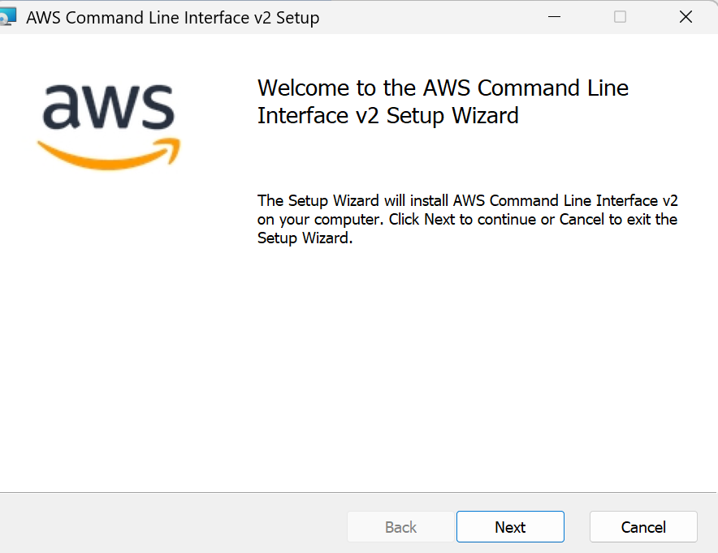


### Step5 -Verify the Installion
Open

Command Prompt

Run

```aws --version```

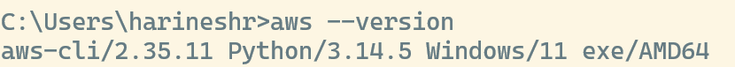

---

# Configure AWS CLI and  Verify AWS Authentication


Run
```cmd
aws configure
```

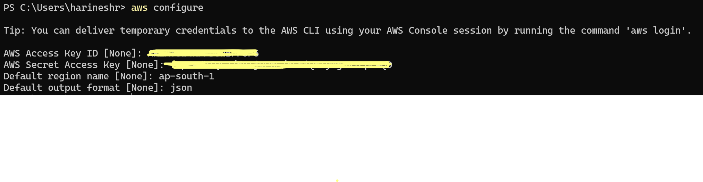


```cmd
aws sts get-caller-identity
```

```
aws configure list
```
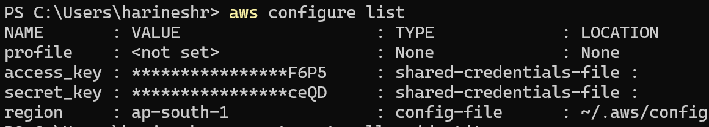
Expected Output

```json
{
    "UserId": "...",
    "Account": "...",
    "Arn": "..."
}
```

If this command returns your AWS Account information, your local machine is successfully authenticated with AWS.

---

# Project Structure

Create the following directory.

```text
terraform-nginx-lab/

│

├── provider.tf

├── versions.tf

├── variables.tf

├── terraform.tfvars

├── main.tf

├── outputs.tf

├── userdata.sh

├── .gitignore

└── README.md
```

---

# Purpose of Each File

## provider.tf

Contains AWS Provider configuration.

Terraform uses this file to determine which cloud provider it should communicate with.

---

## versions.tf

Specifies the required Terraform version and Provider version.

This ensures all engineers use compatible versions.

---

## variables.tf

Contains reusable input variables.

Instead of hardcoding values, variables improve flexibility and maintainability.

---

## terraform.tfvars

Stores actual values for variables.

This allows the same Terraform code to be reused across Development, QA, and Production environments.

---

## main.tf

Contains the infrastructure resources.

This is the primary file where AWS resources are defined.

---

## outputs.tf

Displays useful information after deployment.

Example:

- EC2 Public IP
- EC2 Instance ID
- VPC ID

---

## userdata.sh

Contains the bootstrap script executed when the EC2 instance launches.

This script installs and starts Nginx automatically.

---

## .gitignore

Prevents Terraform-generated files from being committed to Git.

Examples:

- .terraform/
- terraform.tfstate
- terraform.tfstate.backup

---

# Lab Workflow

The complete deployment process for this lab follows the workflow below.

```text
Write Terraform Code

        │

terraform fmt

        │

terraform validate

        │

terraform init

        │

terraform plan

        │

terraform apply

        │

Validate Infrastructure

        │

Access Nginx

        │

terraform destroy
```

---

# What We Will Do In Phase 2

In the next phase we will start writing Terraform code from scratch.

We will create:

- Terraform Block
- AWS Provider
- Variables
- User Data Script
- VPC
- Public Subnet
- Private Subnet

Every line of Terraform code will be explained before it is written.

No code will be copied without understanding its purpose.