# LAB 05: Deploy and Manage the Cake Delivery Application Using Kubernetes Deployments

## Objective

The objective of this lab is to deploy the Cake Delivery application using a Kubernetes Deployment and understand how Deployments provide application lifecycle management, rolling updates, rollbacks, revision history, scaling, and zero-downtime deployments.

#### By completing this lab, you will learn how to:

* Understand Deployment fundamentals
* Create a Deployment
* Understand Deployment strategy
* Perform Rolling Updates
* View Revision History
* Rollback Deployments
* Scale Deployments
* Achieve Zero Downtime Deployments
* Monitor Deployment status
* Understand the relationship between Deployment, ReplicaSet, and Pods

---

## Deployment Fundamentals

### What is a Deployment?

A Deployment is a Kubernetes object that manages ReplicaSets and Pods.

Instead of creating Pods directly, production environments typically create Deployments.

A Deployment provides:

* Self-healing
* Scaling
* Rolling Updates
* Rollbacks
* Version Management
* Zero Downtime Deployments

---

### Deployment Architecture

```text
Deployment
     │
     ▼
ReplicaSet
     │
     ▼
Pods
     │
     ▼
Containers
```

A Deployment creates and manages ReplicaSets.

ReplicaSets create and manage Pods.

Pods run containers.

---

### Why Use Deployments?

Without Deployments:

* Pod updates are manual
* Rollbacks are difficult
* Scaling is manual
* Version management is difficult

With Deployments:

* Updates are automated
* Rollbacks are simple
* Scaling is easy
* Zero downtime updates are possible

---

### What is a Rolling Update?

A Rolling Update gradually replaces old Pods with new Pods.

```text
Version 1 Pods
      ↓
Replace One Pod
      ↓
Version 2 Pod Created
      ↓
Old Pod Removed
      ↓
Continue Until Complete
```

Benefits:

* No downtime
* Continuous availability
* Controlled updates

---

### What is a Rollback?

Rollback restores a previous Deployment version.

Example:

```text
Version 1
   ↓
Update to Version 2
   ↓
Problem Found
   ↓
Rollback
   ↓
Version 1 Restored
```

---

### What is Revision History?

Kubernetes stores Deployment revisions.

Each update creates a new revision.

Example:

```text
Revision 1 → Cake App v1
Revision 2 → Cake App v2
Revision 3 → Cake App v3
```

These revisions allow rollback.

---

### What is Zero Downtime Deployment?

A deployment where application availability remains uninterrupted during updates.

Users continue accessing the application while Pods are being updated.

---

## Prerequisites

Before starting this lab, ensure you have completed:

* Lab 01 - KIND Cluster Setup
* Lab 02 - Cake Delivery Pod Deployment
* Lab 03 - ReplicaSet
* Lab 04 - Labels, Selectors and Annotations

Verify cluster:

```bash
kubectl get nodes
```

Expected Output:

| NAME                           | STATUS |
| ------------------------------ | ------ |
| my-first-cluster-control-plane | Ready  |
| my-first-cluster-worker        | Ready  |
| my-first-cluster-worker2       | Ready  |

Verify image exists:

```bash
docker exec -it my-first-cluster-control-plane crictl images
```

Verify:

```text
cake-delivery:v1
```
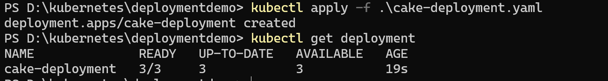
---

## Application Overview

Application Name:

Cake Delivery Application

Current Version:

```text
cake-delivery:v1
```

Deployment Target:

```text
3 Replicas
```

---

# STEPS TO SETUP THINGS

## Step 1 - Create Deployment Manifest

Create file:

```text
cake-deployment.yaml
```

Add:

```yaml
apiVersion: apps/v1
kind: Deployment

metadata:
  name: cake-deployment

spec:
  replicas: 3

  selector:
    matchLabels:
      app: cake-app

  template:
    metadata:
      labels:
        app: cake-app

    spec:
      containers:
      - name: cake-container
        image: cake-delivery:v1

        imagePullPolicy: Never

        ports:
        - containerPort: 80
```

---

## Step 2 - Deploy the Application

Deploy:

```bash
kubectl apply -f cake-deployment.yaml
```

Expected Output:

```text
deployment.apps/cake-deployment created
```

---

## Step 3 - Verify Deployment

Check Deployment:

```bash
kubectl get deployments
```

Expected Output:

```text
NAME              READY   UP-TO-DATE   AVAILABLE
cake-deployment   3/3     3            3
```

---

## Step 4 - Verify ReplicaSet Creation

Display ReplicaSets:

```bash
kubectl get rs
```

Expected Output:

```text
cake-deployment-xxxxxxxx
```

Observation:

Deployment automatically created a ReplicaSet.

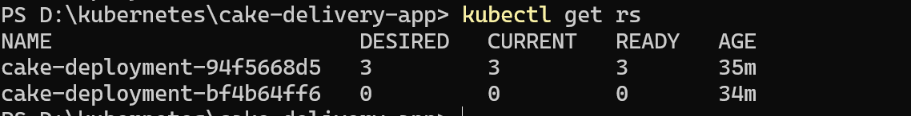
---

## Step 5 - Verify Pod Creation

Display Pods:

```bash
kubectl get pods
```

Expected Output:

```text
cake-deployment-xxxxx
cake-deployment-yyyyy
cake-deployment-zzzzz
```

Observation:

ReplicaSet automatically created Pods.

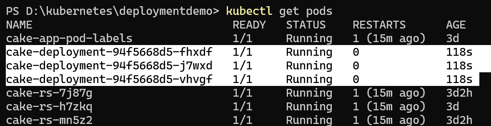
---

## Step 6 - Verify Deployment Details

```bash
kubectl describe deployment cake-deployment
```

Observe:

* Replicas
* Strategy
* Events
* Labels
* Selectors


---

## Step 7 - Access the Application

Forward port:

```bash
kubectl port-forward deployment/cake-deployment 8080:80
```
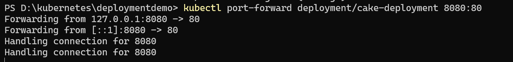
Open:

```text
http://localhost:8080
```

Expected Result:

Cake Delivery application loads successfully.

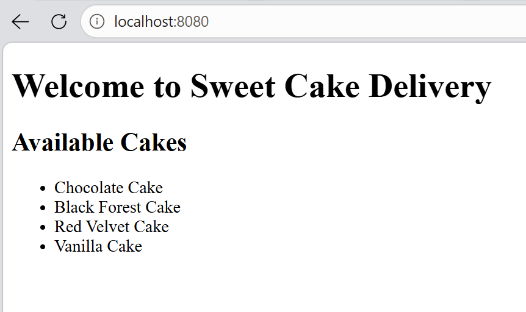
---

# DEPLOYMENT OPERATIONS

## Step 8 - Scale Deployment

Increase replicas:

```bash
kubectl scale deployment cake-deployment --replicas=4
```

Verify:

```bash
kubectl get deployment
```

Expected:

```text
READY 4/4
```

Verify Pods:

```bash
kubectl get pods
```

Four Pods should be running.

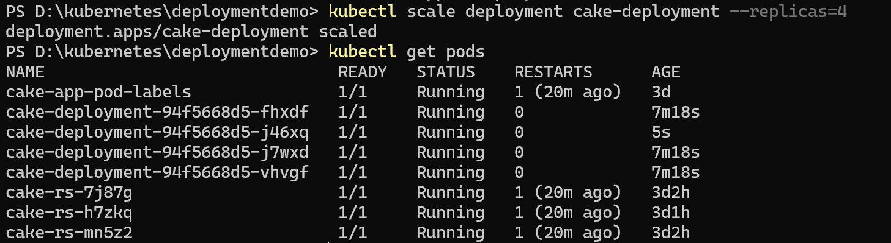
---

## Step 9 - Scale Down Deployment

Reduce replicas:

```bash
kubectl scale deployment cake-deployment --replicas=2
```

Verify:

```bash
kubectl get pods
```

Only two Pods remain.

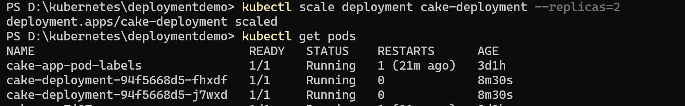


### Scalling up to 5 pods using decalrative way 


```bash
kubectl apply -f cake-deployment.yaml
```
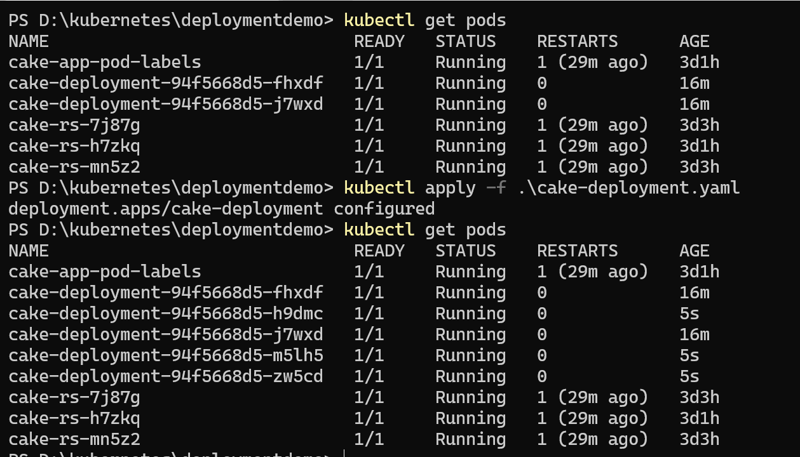
---

# ROLLING UPDATE DEMO

## Step 10 - Create Version 2 Image

Modify:

```text
Appfiles/index.html
```

Change:

```html
<h1>Welcome to Cake Delivery V2</h1>
```

Build:

```bash
docker build -t cake-delivery:v2 .
```

Load into KIND:

```bash
kind load docker-image cake-delivery:v2 --name my-first-cluster
```

---

## Step 11 - Update Deployment

Update image:

```bash
kubectl set image deployment/cake-deployment cake-container=cake-delivery:v2
```

Verify:

```bash
kubectl rollout status deployment/cake-deployment
```

Expected Output:

```text
deployment "cake-deployment" successfully rolled out
```

---

## Step 12 - Watch Rolling Update

Open another terminal:

```bash
kubectl get pods -w
```

Observe:

* New Pods created
* Old Pods terminated
* Application remains available

This demonstrates Rolling Updates.

---

# REVISION HISTORY

## Step 13 - View Revision History

```bash
kubectl rollout history deployment/cake-deployment
```

Expected Output:

```text
REVISION
1
2
```

Observation:

Kubernetes stored Deployment history.

---

# ROLLBACK

## Step 14 - Rollback Deployment

Rollback:

```bash
kubectl rollout undo deployment/cake-deployment
```

Verify:

```bash
kubectl rollout status deployment/cake-deployment
```

Expected Output:

```text
deployment "cake-deployment" successfully rolled out
```

---

## Step 15 - Verify Rollback

Check image:

```bash
kubectl describe deployment cake-deployment
```

Expected:

```text
Image: cake-delivery:v1
```

Observation:

Deployment reverted to Version 1.

---

# ZERO DOWNTIME DEPLOYMENT DEMO

## Step 16 - Demonstrate Zero Downtime

Open browser:

```text
http://localhost:8080
```

Keep application open.

Perform update:

```bash
kubectl set image deployment/cake-deployment cake-container=cake-delivery:v2
```

Observe:

Application remains available while Pods are updated.

This demonstrates Zero Downtime Deployment.

---

## Step 17 - Cleanup

Delete Deployment:

```bash
kubectl delete deployment cake-deployment
```

Verify:

```bash
kubectl get deployments
kubectl get rs
kubectl get pods
```

Expected Result:

All resources removed successfully.
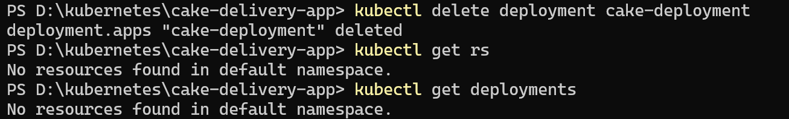
---

## Important Points to Remember

### Deployment

* Manages ReplicaSets
* Provides updates
* Provides rollbacks
* Supports scaling

### Rolling Update

* Default deployment strategy
* Updates Pods gradually
* No downtime

### Check Rollout History

```bash
kubectl rollout history deployment/cake-deployment
```
### Modify Application
Edit:

D:\kubernetes\cake-delivery-app\index.html

Change:

<h1>Welcome to Cake Delivery V2</h1>

Save.

### Build V2 Image

Go to:

D:\kubernetes\cake-delivery-app

Build:

docker build -t cake-delivery:v2 .

Verify:

docker images

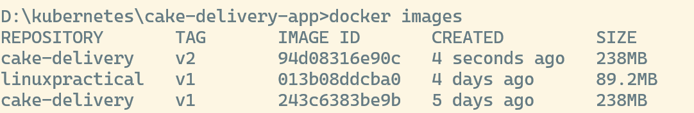

### Load V2 Image into KIND
``` kind load docker-image cake-delivery:v2 --name my-first-cluster```

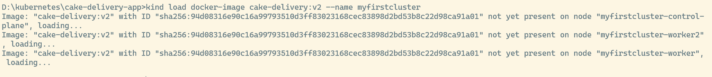

### Update Deployment Image
```kubectl set image deployment/cake-deployment \ cake-container=cake-delivery:v2```
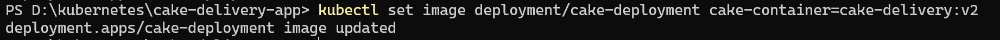

### Watch Rolling Update

Open another terminal:

```kubectl get pods -w```

Observe:

Old Pods Terminating
New Pods Creating

### Verify Rollout
```kubectl rollout status deployment/cake-deployment```
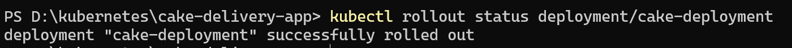

Verify Application

Refresh browser:

http://localhost:8080

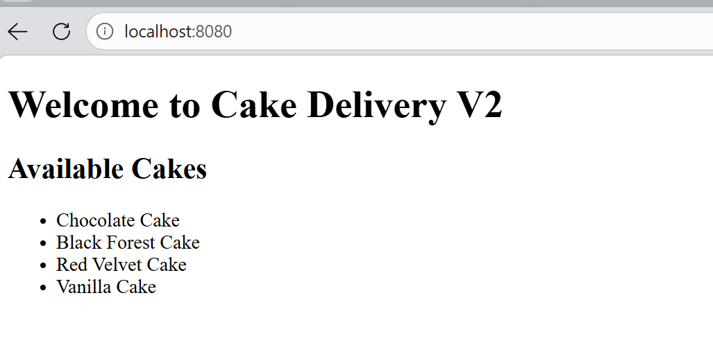

### Revision History

```bash
kubectl rollout history deployment/cake-deployment
```

Shows deployment versions.
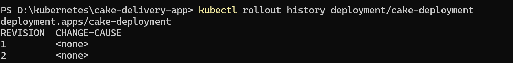

### Rollback Demo
Rollback Deployment

Open new terminal:

```kubectl rollout undo deployment/cake-deployment```
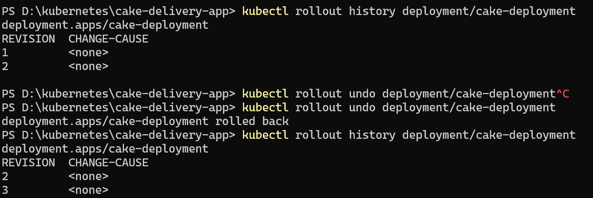

### Verify Rollback Status
```kubectl rollout status deployment/cake-deployment```

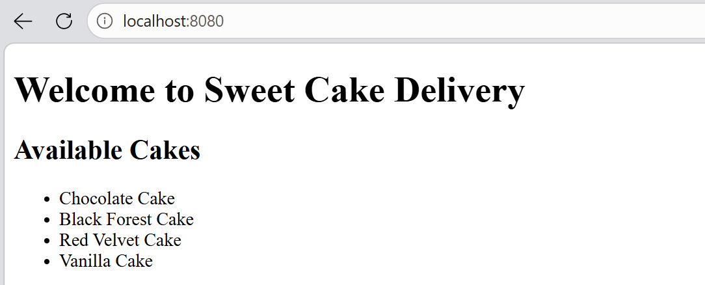
### Check the Revision
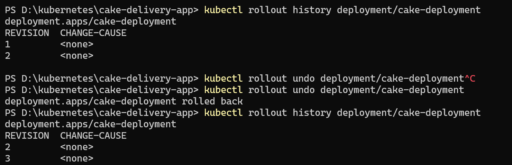

Validate the applciation:


### Zero Downtime

* Application remains available
* Users experience no interruption
* New Pods replace old Pods gradually

## Commands Summary

# Check History
kubectl rollout history deployment/cake-deployment

# Update Image
kubectl set image deployment/cake-deployment cake-container=cake-delivery:v2

# Watch Status
kubectl rollout status deployment/cake-deployment

# Rollback
kubectl rollout undo deployment/cake-deployment

# Verify Deployment
kubectl describe deployment cake-deployment

# Watch Pods
kubectl get pods -w
---

## Verification Checklist

| Verification              | Status |
| ------------------------- | ------ |
| Deployment Created        | ✓      |
| ReplicaSet Created        | ✓      |
| Pods Created              | ✓      |
| Scaling Tested            | ✓      |
| Rolling Update Tested     | ✓      |
| Revision History Verified | ✓      |
| Rollback Tested           | ✓      |
| Zero Downtime Verified    | ✓      |
| Application Accessible    | ✓      |

---

## Expected Outputs

After successful completion of this lab:

* Deployment was created.
* ReplicaSet was automatically created.
* Pods were automatically managed.
* Scaling operations were performed.
* Rolling updates were demonstrated.
* Revision history was verified.
* Rollback functionality was tested.
* Zero downtime deployment was demonstrated.

---

## Lab Summary

In this lab, the Cake Delivery application was deployed using a Kubernetes Deployment. The Deployment automatically created and managed ReplicaSets and Pods. Scaling operations were performed to increase and decrease application replicas. A new application version was introduced using a rolling update strategy, allowing updates without service interruption. Deployment revision history was inspected, and rollback functionality was used to restore a previous application version. This lab demonstrated the complete application lifecycle management capabilities provided by Kubernetes Deployments and showed why Deployments are the preferred method for running applications in production environments.
