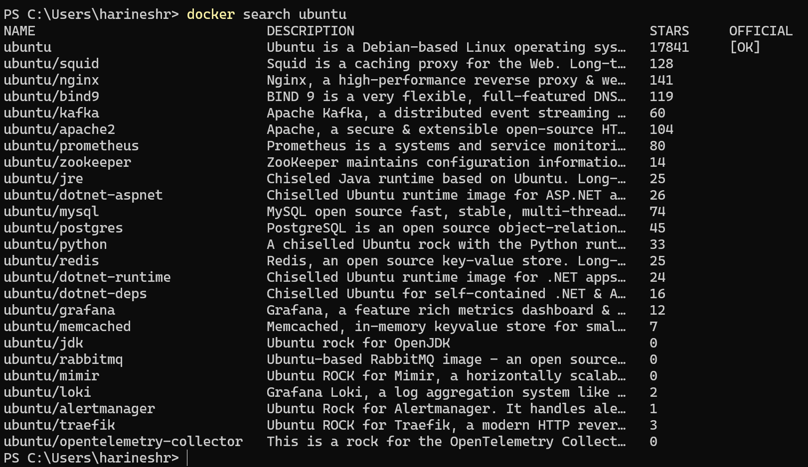
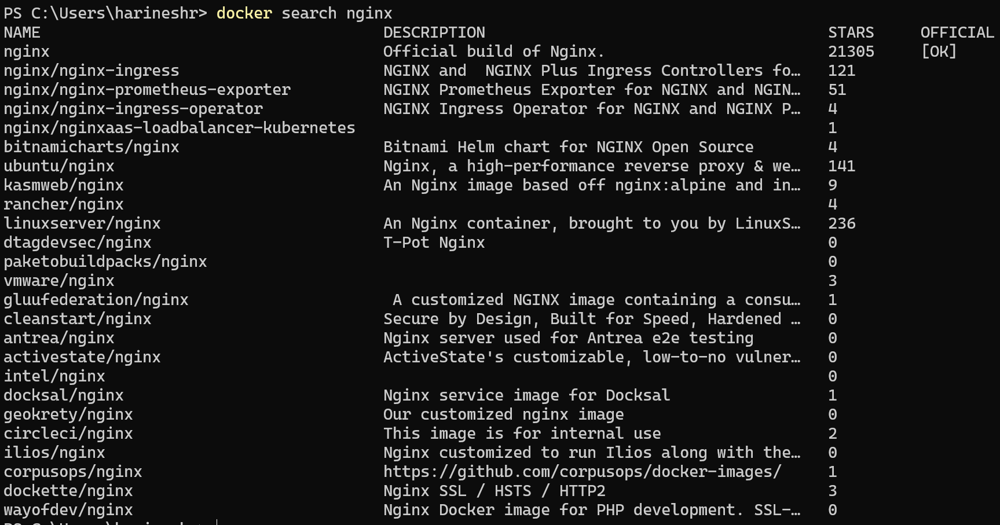
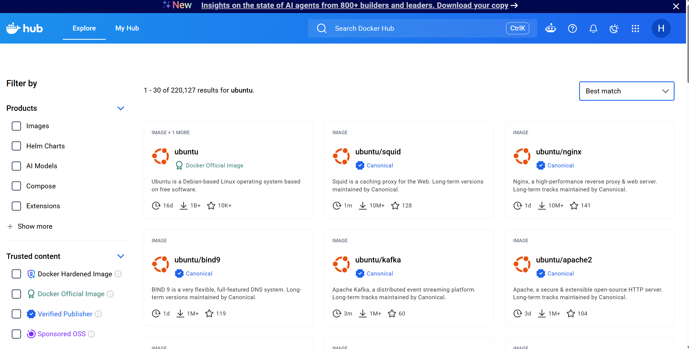

# Lab 01 - Search and Explore Images

## Objective

The objective of this lab is to search and explore Docker images available in Docker Hub and understand image information before downloading.

By completing this lab, you will learn how to:

* Search Docker images from the command line
* Explore Docker Hub repositories
* Identify official images
* Review available image tags
* Understand image descriptions and metadata
* Compare similar images
* Select appropriate images for deployment

---

## Prerequisites

Before starting this lab, ensure you have:

* Docker Desktop installed
* Docker Engine running
* Internet connectivity
* Docker CLI access
* Docker Hub access

Verify Docker installation:

```bash
docker --version
```

Example Output:

```bash
Docker version 28.x.x, build xxxxxxx
```

Verify Docker daemon:

```bash
docker info
```

---

## Lab Environment

| Component           | Value               |
| ------------------- | ------------------- |
| Docker Engine       | Installed           |
| Docker Hub          | Accessible          |
| Internet Connection | Required            |
| Operating System    | Windows/Linux/macOS |

---

## Step 1 - Search for an Image

Search for Ubuntu images available in Docker Hub.

Command:

```bash
docker search ubuntu
```

Expected Result:

* Docker returns a list of matching repositories.
* Repository names and descriptions are displayed.



---

## Step 2 - Search for Nginx Images

Search for Nginx images.

Command:

```bash
docker search nginx
```


Expected Result:

* Multiple Nginx image repositories are displayed.




---

## Step 3 - Explore Docker Hub Website

Open Docker Hub:

```text
https://hub.docker.com
```

Search for:

```text
ubuntu
```

Review:

* Description
* Tags
* Pull count
* Supported architectures
* Last updated date



---


## Step 4 - Explore Image Documentation

Open an official repository.

Example:

```text
ubuntu
```

Review:

* Overview
* Usage instructions
* Supported tags
* Security notes
* Repository information

Expected Result:

* Documentation is available for deployment guidance.

Screenshot:

```text
[Insert Screenshot Here]
```

---

## Verification Steps

Verify the following:

| Check                          | Status |
| ------------------------------ | ------ |
| Docker search command executed | ✓      |
| Ubuntu images explored         | ✓      |
| Nginx images explored          | ✓      |
| Official images identified     | ✓      |
| Docker Hub repository reviewed | ✓      |
| Image tags reviewed            | ✓      |

---

## Expected Outputs

After successful completion of this lab:

* Docker image repositories can be searched.
* Official images can be identified.
* Image tags can be reviewed.
* Docker Hub repositories can be explored.
* Image documentation can be analyzed.
* Appropriate images can be selected for future deployments.

---

## Cleanup

No cleanup is required for this lab.

No images are downloaded during this exercise.

---

## Key Learning Points

* Docker Hub is the default public image registry.
* Docker images can be searched before downloading.
* Official images are generally preferred for production use.
* Tags represent different image versions.
* Docker Hub provides documentation and metadata for images.
* Multiple repositories may exist for the same application.

---

## Lab Summary

In this lab, Docker image discovery and exploration were performed using both the Docker CLI and Docker Hub. Various repositories such as Ubuntu, Nginx, Redis, MySQL, and Node.js were searched and analyzed. Official images, tags, repository metadata, and documentation were reviewed to understand how Docker images are selected before deployment. This foundational knowledge will be used in the next lab when downloading images to the local Docker host.
