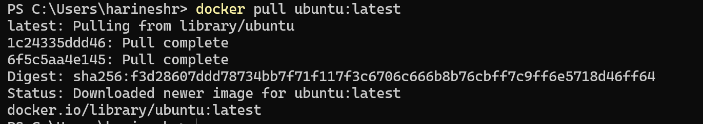
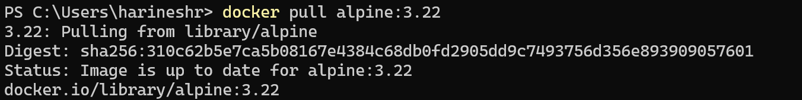
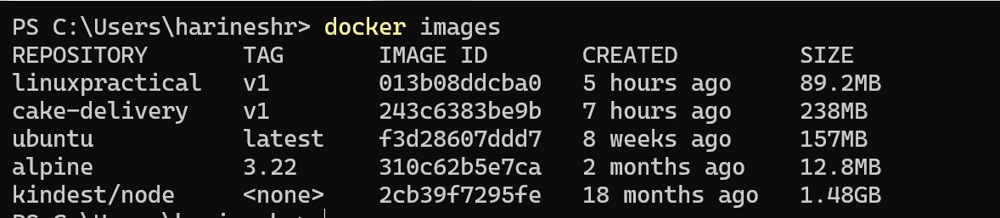
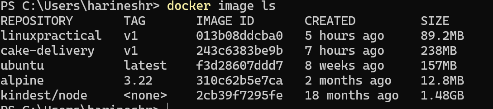
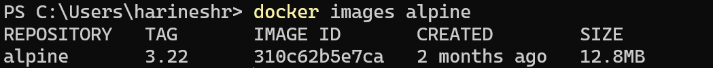

# Lab 02 - Pull Images and List Images

## Objective

The objective of this lab is to download Docker images from Docker Hub and verify that they are available on the local Docker host.

By completing this lab, you will learn how to:

* Pull Docker images from Docker Hub
* Pull images with specific tags
* View locally available images
* Understand image repositories and tags
* Verify downloaded images

---

## Prerequisites

Before starting this lab, ensure you have:

* Docker installed
* Docker service running
* Internet connectivity

Verify Docker installation:

```bash
docker --version
```

Verify Docker daemon:

```bash
docker info
```

---

## Step 1 - Pull Ubuntu Image

Pull the latest Ubuntu image.

Command:

```bash
docker pull ubuntu
```

Expected Result:

Docker downloads the Ubuntu image successfully.


---

## Step 2 - Pull Specific Image Tag

Pull a specific apline linux version.

Command:

```bash
docker pull aalpine:3.22
```

Expected Result:

alpine linux 3.22 image is downloaded.

---

## Step 4 - List Local Images

Display all images available on the local system.

Command:

```bash
docker images
```

OR

```bash
docker image ls
```

Example Output:

```text
REPOSITORY   TAG       IMAGE ID       CREATED       SIZE
ubuntu       latest    xxxxxxxxxxxx   x days ago    xx MB
ubuntu       22.04     xxxxxxxxxxxx   x days ago    xx MB
nginx        latest    xxxxxxxxxxxx   x days ago    xx MB
```

Expected Result:

All downloaded images are displayed.




---

## Step 5 - View Specific Image

Filter and display alpine images.

Command:

```bash
docker images alpine
```

Expected Result:

Only alpine-related images are displayed.


---


## Verification Steps

Verify the following:

| Check                        | Status |
| ---------------------------- | ------ |
| Ubuntu image pulled          | ✓      |
| Ubuntu specific tag pulled   | ✓      |
| Local images listed          | ✓      |


---

## Expected Outputs

After successful completion of this lab:

* Multiple Docker images are downloaded locally.
* Images can be viewed using Docker CLI.
* Repository names are visible.
* Tags are visible.
* Image IDs are visible.
* Image sizes can be reviewed.

---

## Cleanup

No cleanup is required for this lab.

The downloaded images will be used in upcoming labs.

---

## Key Learning Points

* `docker pull` downloads images from Docker Hub.
* `latest` is the default tag when no tag is specified.
* Multiple versions of the same image can exist locally.
* `docker images` displays locally stored images.
* Every image has a unique Image ID.

---

## Lab Summary

In this lab, Docker images were downloaded from Docker Hub using the `docker pull` command. Ubuntu, Nginx, and Redis images were pulled successfully, including a specific Ubuntu version tag. The downloaded images were verified using the `docker images` command, providing an understanding of repositories, tags, image IDs, and image sizes stored on the local Docker host.
