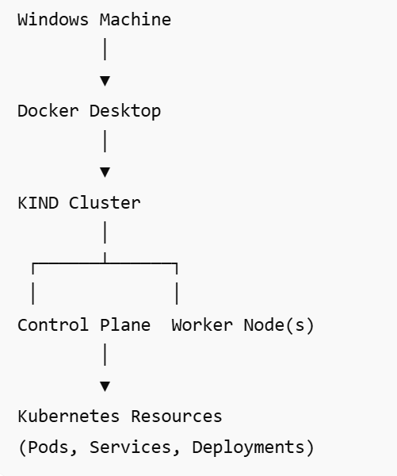

# Lab 01 - Kubernetes Cluster Setup Using KIND on Windows

**Objective**
The objective of this lab is to install and configure a local Kubernetes cluster on Windows using KIND (Kubernetes IN Docker).

  By completing this lab, you will learn how to:

 - Install Docker Desktop
 - Install kubectl
 - Install KIND
 - Create a Kubernetes cluster locally
 - Verify cluster components
 - Interact with the cluster using kubectl
 - Deploy a test application
 - Access Kubernetes resources
 - Delete the cluster when finished

**Prerequisites**

Before starting this lab, ensure you have:
| Requirement              | Status      |
| ------------------------ | ----------- |
| Windows 10/11            | Required    |
| Administrator Access     | Required    |
| Docker Desktop Installed | Required    |
| WSL2 Enabled             | Recommended |
| Internet Connectivity    | Required    |

**Architecture**

**Installtion Steps:**

#### Step 1 - Verify Docker Installation

Open PowerShell or CMD.

Execute:

`docker version`

Expected Result:

Docker Client and Server information should be displayed.

### Step 2 - Verify Docker Desktop is Running

Check Docker status:

docker ps

Expected Result:

### Step 3 - Install kubectl

Download kubectl:

`curl.exe -LO "https://dl.k8s.io/release/v1.34.0/bin/windows/amd64/kubectl.exe"`

Move kubectl.exe to a folder & Set as varibale  in PATH.

Verify installation:

`kubectl version --client`

### Step 4 - Install KIND

Download KIND:

`curl.exe -Lo kind.exe https://kind.sigs.k8s.io/dl/latest/kind-windows-amd64`

Move kind.exe to a directory & Set as varibale  in PATH.

Verify installation:

kind version