# Lab 01 - Kubernetes Cluster Setup Using KIND on Windows

### Objective

This lab demonstrates how to install kubectl and KIND on Windows and create Kubernetes clusters using both imperative and declarative approaches.

#### Important Installation links:

Documentation for [Kubectl Installation](https://kubernetes.io/docs/tasks/tools/)

Documentation for [KIND Installation](https://kind.sigs.k8s.io/docs/user/quick-start/)


  By completing this lab, you will learn how to:

 -  Install kubectl
 - Install KIND
 - Create a Kubernetes cluster locally
 - Verify cluster components
 - Interact with the cluster using kubectl
 -  Access Kubernetes resources
 - Delete the cluster when finished

### Prerequisites

Before starting this lab, ensure you have:
| Requirement              | Status      |
| ------------------------ | ----------- |
| Windows 10/11            | Required    |
| Administrator Access     | Required    |
| Docker Desktop Installed | Required    |
| WSL2 Enabled             | Recommended |
| Internet Connectivity    | Required    |


## Architecture

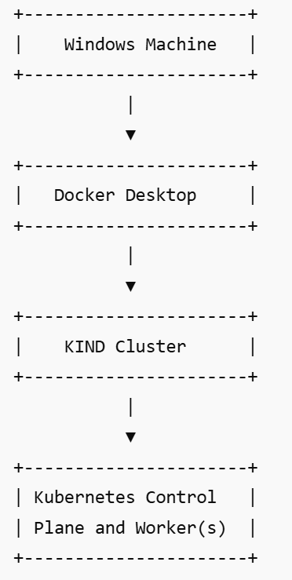


## Installation Steps 

### Step 1 - Verify Docker Installation

Open PowerShell or CMD.

Execute:

`docker version`

Expected Result:

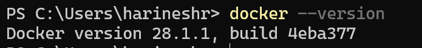

### Step 2 - Verify Docker Desktop is Running

Check Docker status:

docker ps

Expected Result:

Expected Result:

Docker should display the list of running containers. If no containers are running, an empty list will be displayed.

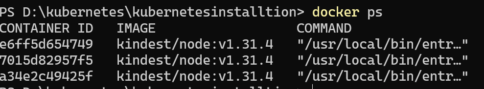

### Step 3 - Install kubectl

Download kubectl:

`curl.exe -LO "https://dl.k8s.io/release/v1.34.0/bin/windows/amd64/kubectl.exe"`

Move kubectl.exe to a directory included in the system PATH environment variable.
Verify installation:

`kubectl version --client`

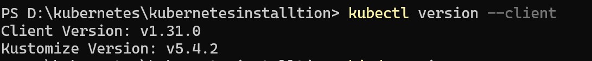

### Step 4 - Install KIND

Download KIND:

`curl.exe -Lo kind.exe https://kind.sigs.k8s.io/dl/latest/kind-windows-amd64`

Move kind.exe to a directory & Set as varibale  in PATH.

Verify installation:

`kind version`

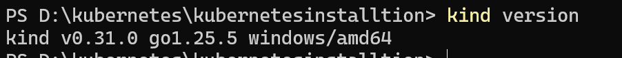


# Create Cluster Using Imperative Method

### Step 1 -Create a cluster using the default KIND configuration.

Execute:

`kind create cluster --name myfirstcluster`

Expected Result:
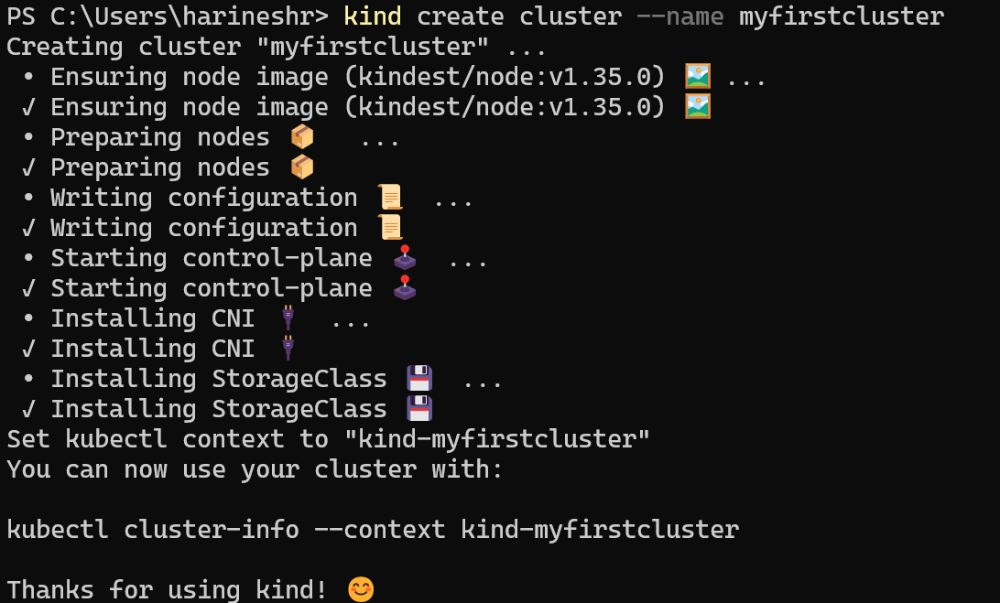

### Step 2 - Verify Cluster

Check cluster information.

`kubectl cluster-info`

Expected Result:
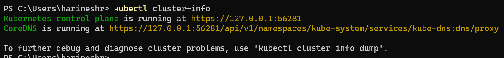

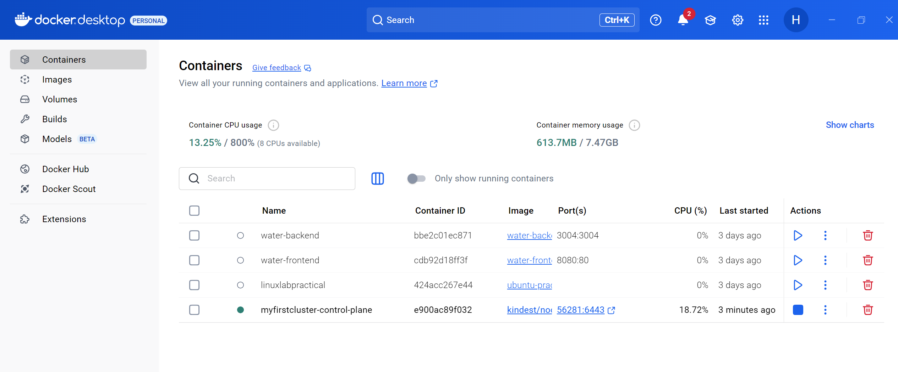

### Step 3 - Verify Nodes

Execute:

```bash
kubectl get nodes
kubectl get nodes -o wide
```

Expected Result:
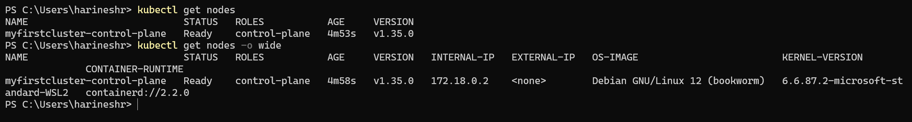

### Step 4 - Verify Kubernetes System Pods

Execute:

`kubectl get pods -A`

Expected Result:
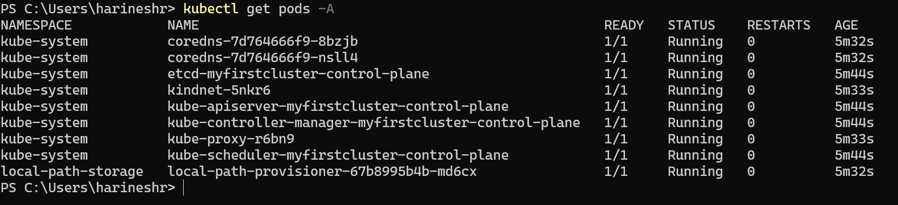

### Step 5 - Delete Imperative Cluster

Execute:

`kind delete cluster --name myfirstcluster`


Expected Result:

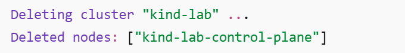

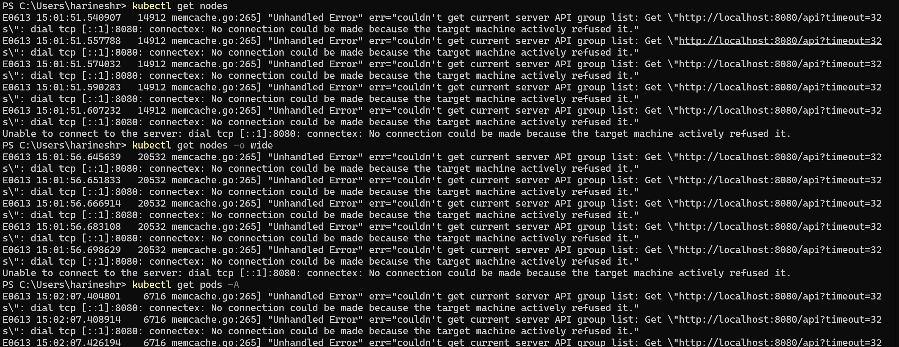


# Create Cluster Using Declarative Configuration

### Step 1 - Create yaml configuration file:

kind-cluster.yaml

```yaml
# kind-cluster-config.yaml
kind: Cluster
apiVersion: kind.x-k8s.io/v1alpha4

# Specify the Kubernetes version by using a specific node image
# Visit https://hub.docker.com/r/kindest/node/tags and https://github.com/kubernetes-sigs/kind/releases for available images
nodes:
  - role: control-plane
    image: kindest/node:v1.31.4@sha256:2cb39f7295fe7eafee0842b1052a599a4fb0f8bcf3f83d96c7f4864c357c6c30 # Replace with the Kubernetes version you want
  - role: worker
    image: kindest/node:v1.31.4@sha256:2cb39f7295fe7eafee0842b1052a599a4fb0f8bcf3f83d96c7f4864c357c6c30
  - role: worker
    image: kindest/node:v1.31.4@sha256:2cb39f7295fe7eafee0842b1052a599a4fb0f8bcf3f83d96c7f4864c357c6c30
```

This configuration creates:

1 Control Plane Node


2 Worker Nodes

### Step 2 - Create Cluster Using Configuration File

Execute:

`kind create cluster --name myfirstcluster --config kind-cluster.yamll`

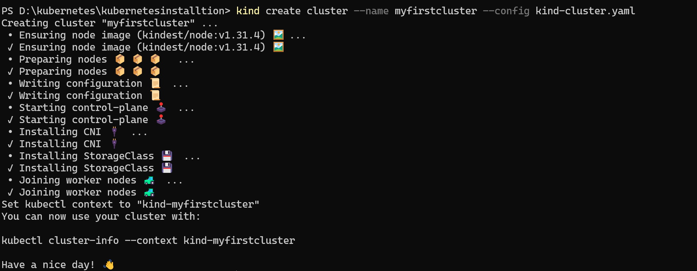

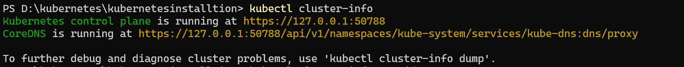

we can create one more cluster with different api version 

create kind-cluster.yaml

``` yaml
kind: Cluster
apiVersion: kind.x-k8s.io/v1alpha4

nodes:
  - role: control-plane

  - role: worker

  - role: worker```
```

Execute:

`kind create cluster --name myfirstcluster --config kind-cluster.yaml`

### Step 3 - Verify Multi-Node Cluster

Execute:

`kubectl get nodes`

Expected Result:
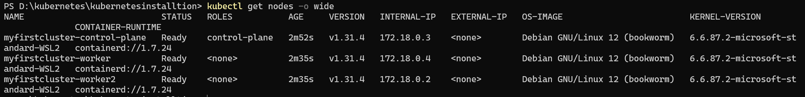

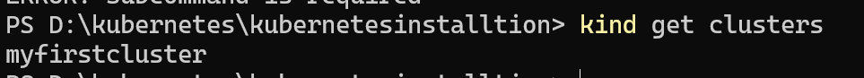

### Step 4 - Verify Docker Containers

KIND creates Kubernetes nodes as Docker containers.

Execute:

`docker ps`

Expected Result:
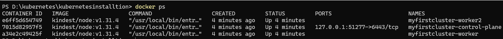

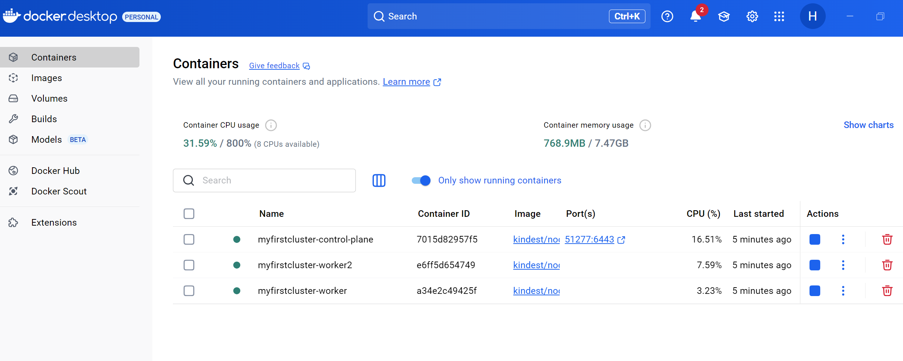

### Step 5 - Delete Declarative Cluster

Execute: 

`kind delete cluster --name myfirstcluster`


**Lab Summary**

In this lab, KIND and kubectl were successfully installed on Windows. A Kubernetes cluster was created using both imperative and declarative approaches. Cluster health, nodes, and Kubernetes system components were verified using kubectl commands. The underlying Docker containers representing Kubernetes nodes were also validated. Finally, the clusters were deleted, completing the full KIND cluster lifecycle management process.