# LAB 03: Deploy and Manage a ReplicaSet for the Online Cake Delivery Application

## Objective

The objective of this lab is to deploy the Online Cake Delivery application using a Kubernetes ReplicaSet and understand how ReplicaSets provide self-healing and scaling capabilities.

#### By completing this lab, you will learn how to:

Create a ReplicaSet manifest
Deploy a ReplicaSet in Kubernetes
Maintain multiple Pod replicas
Verify ReplicaSet status
Understand label selectors
Test ReplicaSet self-healing capability
Scale application replicas
Observe Pod recreation automatically
Understand the relationship between ReplicaSet and Pods

### Prerequisites

Before starting this lab, ensure you have completed:

* Lab 01 - KIND Cluster Setup
* Lab 02 - Build and Deploy an Online Cake Delivery Application on KIND Kubernetes Cluster

Verify the cluster is running:

```bash
kubectl get nodes
```

Expected Output:

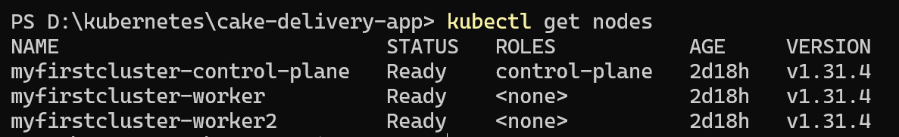

Verify the Cake Delivery images/image exists inside the KIND cluster:

```bash
docker exec -it my-first-cluster-control-plane crictl images/images
```
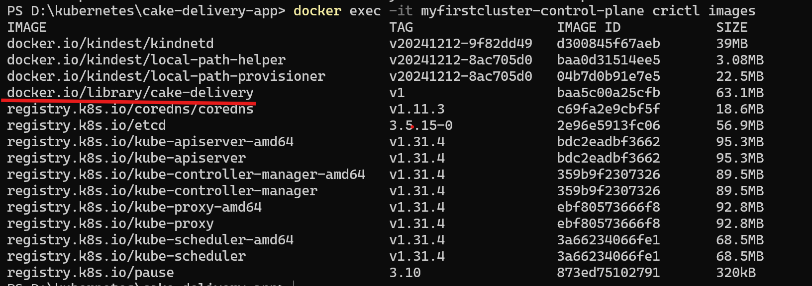
---

### Application Overview

In this lab, we will deploy the Online Cake Delivery application using a ReplicaSet.

Application Features:

Display Cake Store Homepage

Maintain multiple application instances

Automatically recreate failed Pods

Support application scaling

Demonstrate Kubernetes self-healing

---

## STEPS TO SETUP THINGS

### Step 1 - Clean Up Previous Pod Deployment

Delete the standalone Pod created in Lab 02.

```bash
kubectl delete pod cake-app
```

Verify the Pod is removed:

```bash
kubectl get pods
```

Expected Result:

No Cake Delivery Pods should be running.

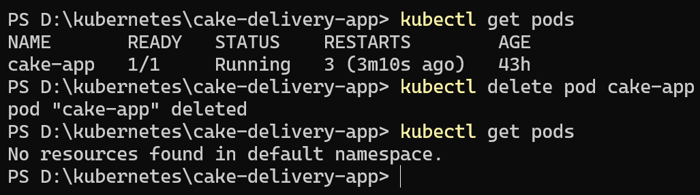

---

## Create a Project folder: This we can use for lab project bulinding 

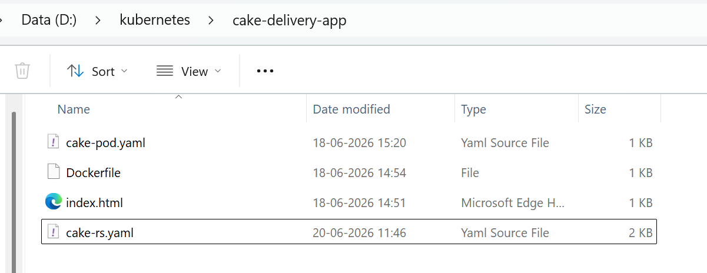

### Step 2 - Create ReplicaSet Manifest

Create a file named:

```text
cake-rs.yaml
```

Add the following content:

```yaml
apiVersion: apps/v1
kind: ReplicaSet

metadata:
  name: cake-rs

spec:
  replicas: 3

  selector:
    matchLabels:
      app: cake-app

  template:
    metadata:
      labels:
        app: cake-app

    spec:
      containers:
      - name: cake-container
        images/image: cake-delivery:v1

        images/imagePullPolicy: Never

        ports:
        - containerPort: 80
```

Explanation:

| Property        | Value            |
| --------------- | ---------------- |
| Kind            | ReplicaSet       |
| ReplicaSet Name | cake-rs          |
| Replicas        | 3                |
| Label           | app=cake-app     |
| Container Name  | cake-container   |
| images/image           | cake-delivery:v1 |
| Container Port  | 80               |

---

### Step 3 - Deploy the ReplicaSet

Deploy the ReplicaSet:

```bash
kubectl apply -f cake-rs.yaml
```
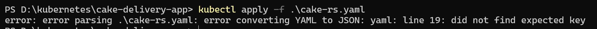

The error is because of indentation.
Kubernetes is reading:
```
spec:
  template:
      metadata:
      labels:

as:

template:
  metadata: null

labels:

which is invalid.
Correct:

template:
  metadata:
    labels:
      app: cake-app

  spec:
    containers:

```


Expected Output:

```text
replicaset.apps/cake-rs created
```
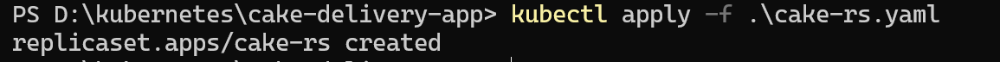
---

### Step 4 - Verify ReplicaSet Status

Check ReplicaSet details:

```bash
kubectl get rs
```

Expected Output:

```text
NAME      DESIRED   CURRENT   READY
cake-rs   3         3         3
```

Observe:

ReplicaSet successfully created three Pods.
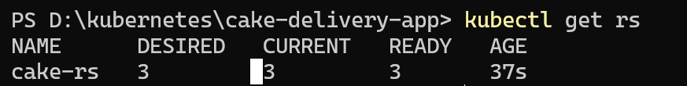
---

### Step 5 - Verify Pod Creation

Display running Pods:

```bash
kubectl get pods
```

Expected Output:

```text
cake-rs-xxxxx
cake-rs-yyyyy
cake-rs-zzzzz
```

Observe:

Three Pods were automatically created by the ReplicaSet.
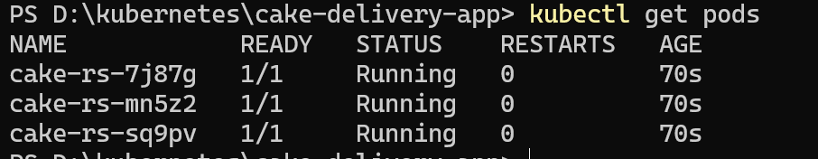
---

### Step 6 - Verify Pod Placement

Check Pod scheduling information:

```bash
kubectl get pods -o wide
```

Observe:

Pods may be scheduled across worker nodes by Kubernetes.

This demonstrates Kubernetes scheduling decisions.
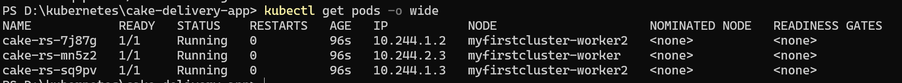
---

### Step 7 - View ReplicaSet Details

Describe the ReplicaSet:

```bash
kubectl describe rs cake-rs
```

Observe:

Replica count

Selector labels

Pod template

Events section

ReplicaSet status
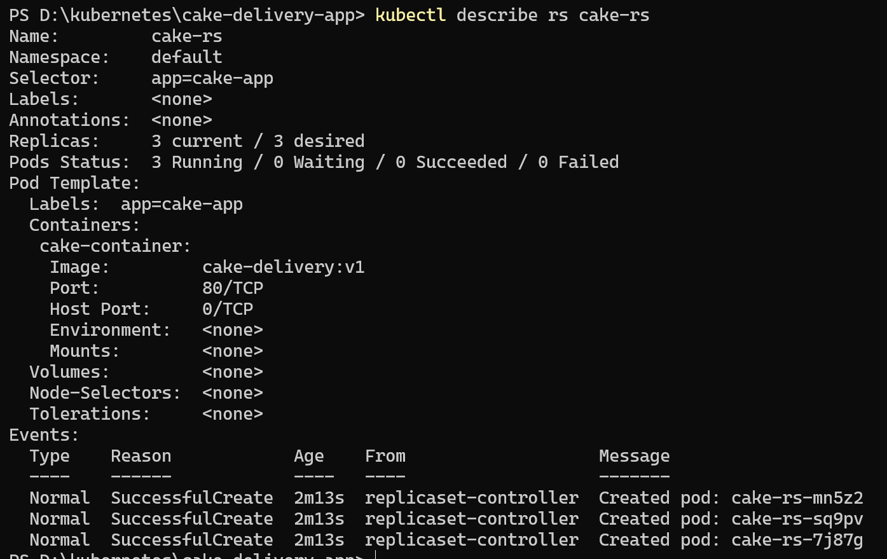
---

### Step 8 - Test ReplicaSet Self-Healing

Delete one of the Pods manually.

First list the Pods:

```bash
kubectl get pods
```

Delete one Pod:

```bash
kubectl delete pod <pod-name>
```

Example:

```bash
kubectl delete pod cake-rs-sq9pv
```

Immediately verify:

```bash
kubectl get pods
```

Observe:

The deleted Pod disappears.

A new Pod is automatically created.

Replica count remains three.

This demonstrates ReplicaSet self-healing capability.
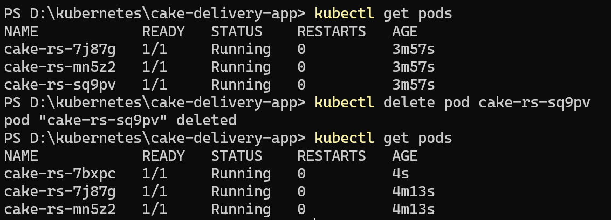
---

### Step 9 - Scale the ReplicaSet

Increase the number of replicas. 

Imperative way:

```bash
kubectl scale rs cake-rs --replicas=4
```

Verify:

```bash
kubectl get rs
```

Expected Output:

```text
NAME      DESIRED   CURRENT   READY
cake-rs   4         4         4
```

Display Pods:

```bash
kubectl get pods
```

Observe:

Five Pods are now running.
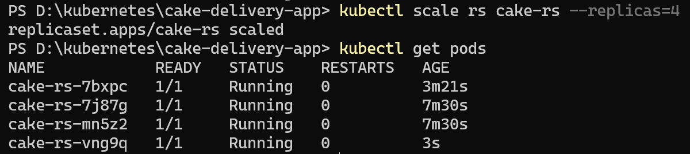

Declarative way:
 Edit the YML and reapply the RS

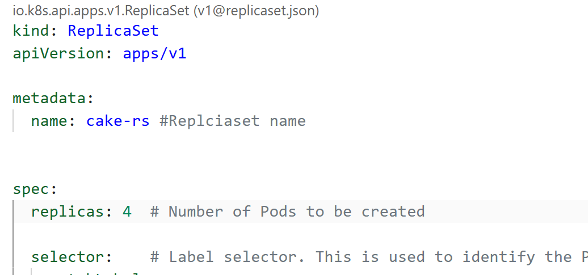

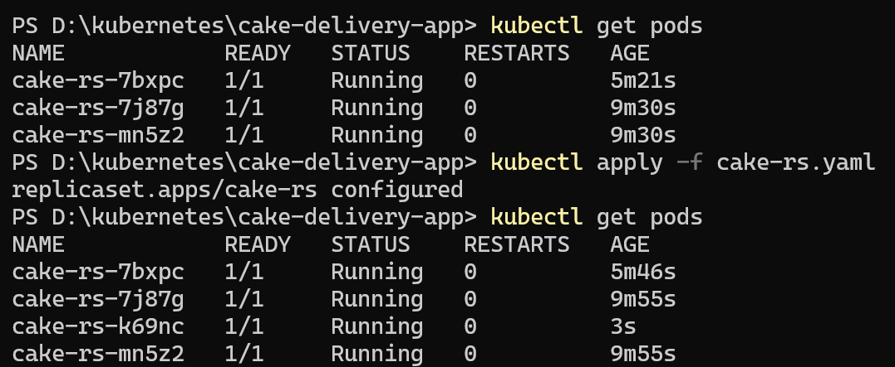
---

### Step 10 - Scale Down the ReplicaSet

Reduce the replica count.

```bash
kubectl scale rs cake-rs --replicas=2
```

Verify:

```bash
kubectl get pods
```

Observe:

Only two Pods remain running.

ReplicaSet automatically removes extra Pods.
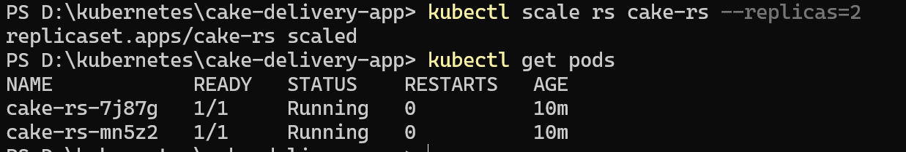
---

### Step 11 - Access the Application

Forward local port to one of the Pods:

First identify a Pod:

```bash
kubectl get pods
```

Forward the port:

```bash
kubectl port-forward pod/<pod-name> 8080:80
```

Example:

```bash
kubectl port-forward pod/cake-rs-k4pxd 8080:80
```
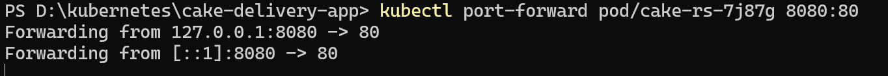

Open browser:

```text
http://localhost:8080
```

Expected Result:

The Cake Delivery application page should be displayed successfully.

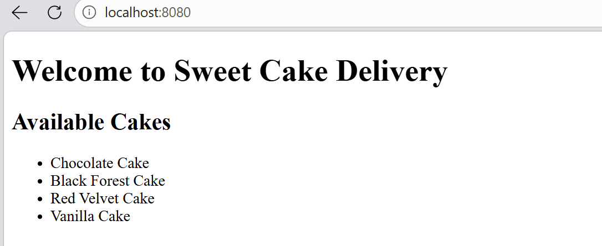
---


### Verification Checklist

| Verification                    | Status |
| ------------------------------- | ------ |
| ReplicaSet Manifest Created     | ✓      |
| ReplicaSet Deployed             | ✓      |
| Multiple Pods Created           | ✓      |
| Labels Verified                 | ✓      |
| Selector Verified               | ✓      |
| Self-Healing Tested             | ✓      |
| Replica Scaling Tested          | ✓      |
| Scale Down Tested               | ✓      |
| Application Accessible          | ✓      |


---

### Expected Outputs

After successful completion of this lab:

A ReplicaSet was created.

Multiple Pod replicas were deployed.

ReplicaSet maintained desired state.

Pod self-healing was demonstrated.

Replica scaling was verified.

Application availability was maintained.

ReplicaSet lifecycle was validated.

---

### Lab Summary

In this lab, the Online Cake Delivery application was deployed using a Kubernetes ReplicaSet. Multiple Pod replicas were created and managed automatically by Kubernetes. The self-healing capability of ReplicaSets was demonstrated by deleting a running Pod and observing Kubernetes automatically create a replacement Pod. Scaling operations were performed to increase and decrease the number of application instances. This lab provided practical experience with one of Kubernetes' core workload management components and demonstrated how ReplicaSets ensure application availability and desired state management.


### ReplicationController vs ReplicaSet

Both ReplicationController (RC) and ReplicaSet (RS) are Kubernetes controllers used to maintain a desired number of Pod replicas. If a Pod fails or is deleted, they automatically create a new Pod to ensure the specified replica count is maintained. ReplicaSet is the newer and enhanced version of ReplicationController, providing more flexible label selector capabilities through matchLabels and matchExpressions. In modern Kubernetes environments, ReplicaSets are typically managed by Deployments, while ReplicationControllers are considered legacy objects and are rarely used in production.


