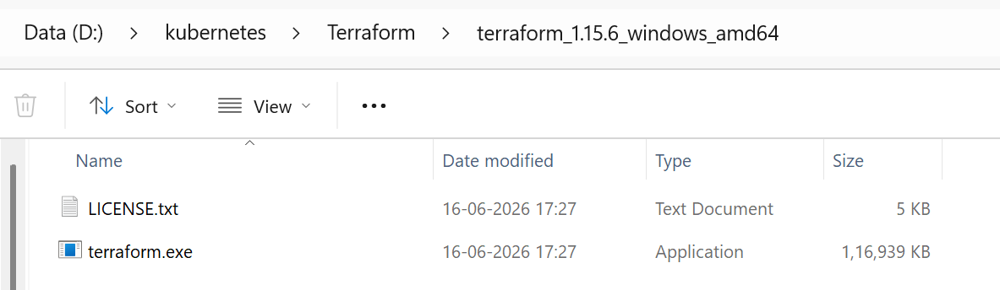
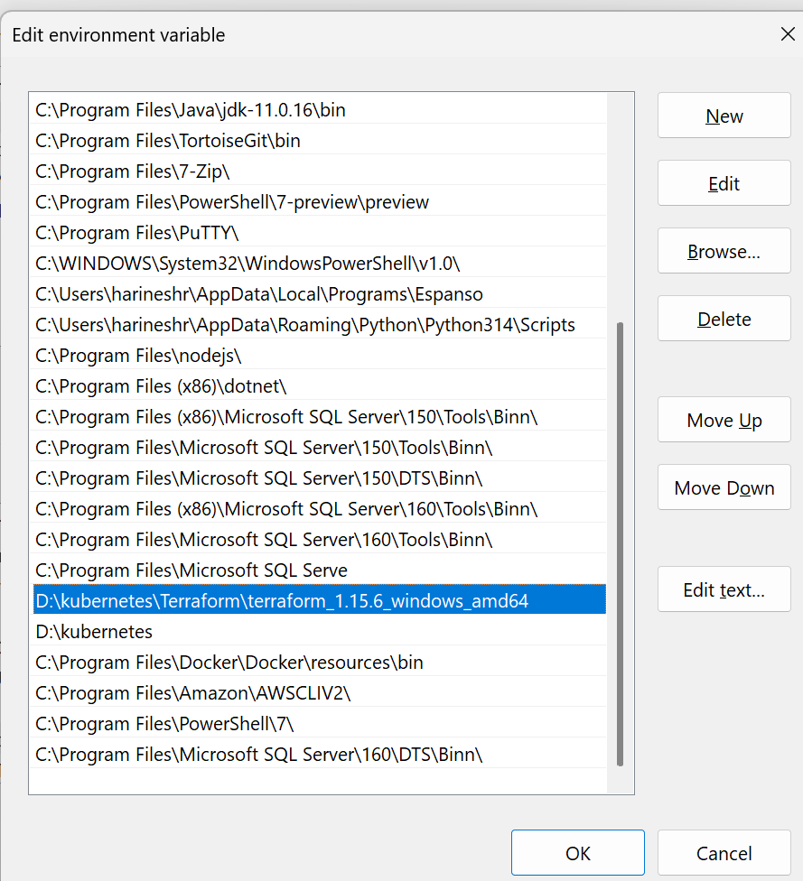
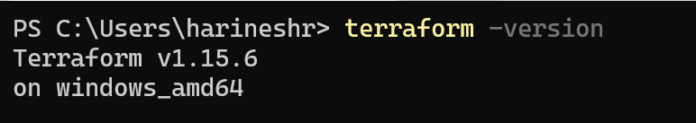
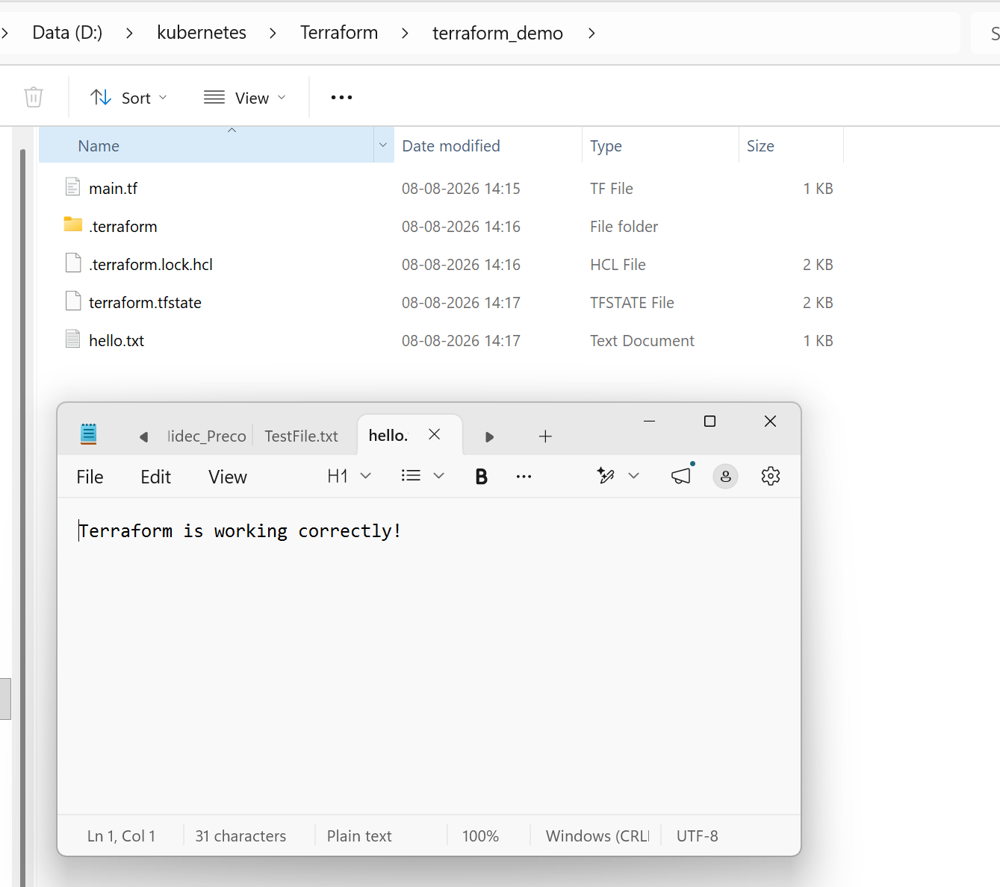

# Terraform Installation Guide — Windows

A clean, step-by-step guide to installing HashiCorp Terraform on Windows — from binary download to your first `terraform init`. Written as part of my DevOps infrastructure automation portfolio.


---

##  Overview

Terraform is HashiCorp's open-source **Infrastructure as Code (IaC)** tool used to provision and manage cloud resources declaratively. This guide covers two reliable installation methods on Windows:

- **Method 1:** Manual binary install (no dependencies, full control)
- **Method 2:** Package manager install via Chocolatey (fastest, auto-updatable)

---

##  Prerequisites

| Requirement | Details |
|---|---|
| OS | Windows 10 / 11 (64-bit recommended) |
| Permissions | Administrator access (for PATH edits) |
| Terminal | PowerShell or Command Prompt |
| Optional | [Chocolatey](https://chocolatey.org/install) package manager |

---

##  Method 1: Manual Installation (Binary)

### Step 1 — Download the Terraform binary
1. Go to the official Terraform downloads page: https://developer.hashicorp.com/terraform/install
2. Under **Windows**, download the **AMD64** `.zip` package (matches most modern PCs).


### Step 2 — Create a dedicated Terraform folder
Open PowerShell and run:
```powershell
mkdir "C:\Terraform"
```

### Step 3 — Extract the binary
Unzip the downloaded file so that `terraform.exe` sits directly inside:
```
C:\Terraform\terraform.exe
```


### Step 4 — Add Terraform to your System PATH
1. Press `Win + S`, search **"Environment Variables"**, open **"Edit the system environment variables"**.
2. Click **Environment Variables**.
3. Under **System variables**, select `Path` → **Edit** → **New**.
4. Add:
   ```
   C:\Terraform
   ```
5. Click **OK** on all windows to save.



### Step 5 — Verify installation
Open a **new** PowerShell window (important — refreshes PATH) and run:
```powershell
terraform -version
```
Expected output:
```
Terraform v1.x.x
on windows_amd64
```

---

##  Method 2: Install via Chocolatey (Recommended for quick setup)

### Step 1 — Install Chocolatey (skip if already installed)
Run PowerShell **as Administrator**:
```powershell
Set-ExecutionPolicy Bypass -Scope Process -Force; `
[System.Net.ServicePointManager]::SecurityProtocol = [System.Net.ServicePointManager]::SecurityProtocol -bor 3072; `
iex ((New-Object System.Net.WebClient).DownloadString('https://community.chocolatey.org/install.ps1'))
```

### Step 2 — Install Terraform
```powershell
choco install terraform -y
```

### Step 3 — Verify installation
```powershell
terraform -version
```

### Step 4 — Upgrade later (as needed)
```powershell
choco upgrade terraform -y
```

---

##  Quick Sanity Check — First Terraform Project

```powershell
mkdir terraform-demo
cd terraform-demo
```

Create a file `main.tf`:
```hcl
terraform {
  required_providers {
    local = {
      source  = "hashicorp/local"
      version = "~> 2.0"
    }
  }
}

resource "local_file" "hello" {
  filename = "${path.module}/hello.txt"
  content  = "Terraform is working correctly!"
}
```


Run:
```powershell
terraform init
terraform plan
terraform apply -auto-approve
```

If `hello.txt` is created with the expected content, your installation is fully functional. 


---

##  Troubleshooting

| Issue | Fix |
|---|---|
| `'terraform' is not recognized...` | PATH not updated or terminal not restarted — open a new terminal window |
| Antivirus blocks `terraform.exe` | Add an exclusion for `C:\Terraform` in Windows Defender |
| Version not updating after upgrade | Run `refreshenv` (Chocolatey) or restart terminal |
| Permission denied on PATH edit | Re-open PowerShell/System Properties as Administrator |

---

##  References

- [Official Terraform Docs](https://developer.hashicorp.com/terraform/docs)
- [Terraform Downloads](https://developer.hashicorp.com/terraform/install)
- [Chocolatey Package: Terraform](https://community.chocolatey.org/packages/terraform)

---

## 👤 Author

**Harinesh** — Senior Infrastructure DevOps Engineer
Building production-grade DevOps labs and automation projects.
🔗 [GitHub Portfolio](https://github.com/harineshd)

---

⭐ If this guide helped you, consider starring the repo!